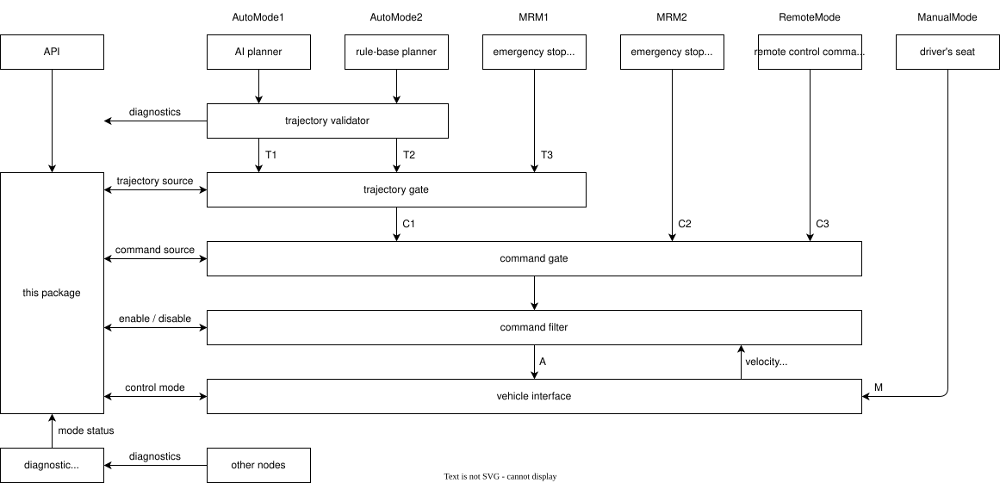
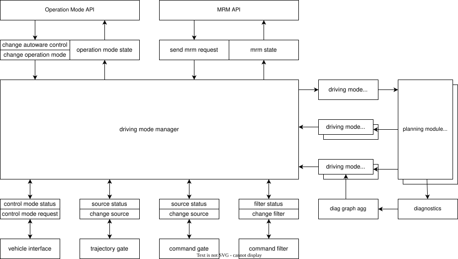
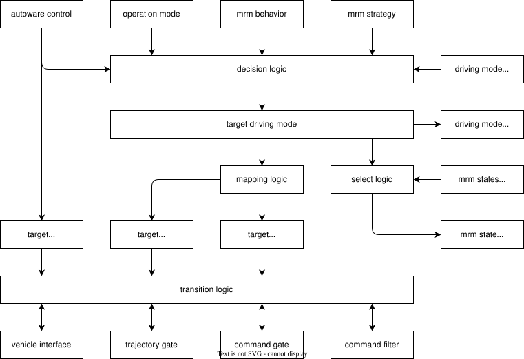
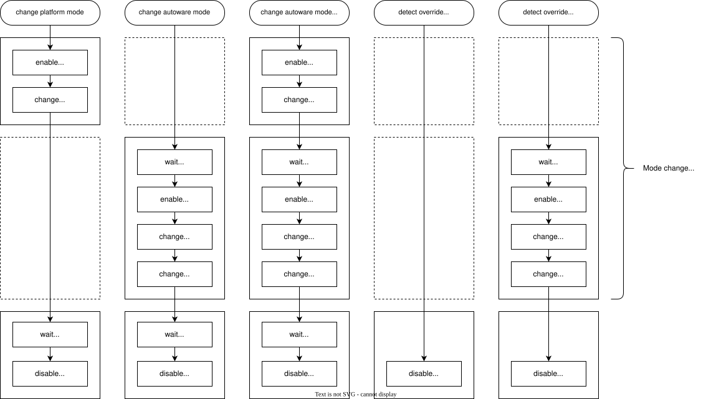

# autoware_driving_mode_manager

## Overview

Autoware performs different behaviors depending on the API and the diagnostics.
Each behavior outputs either a trajectory or a command, and they are selected by the trajectory gate and command gate as shown below.
This package checks the current state of Autoware and controls the relevant nodes to perform appropriate behavior.

## Driving Mode

In this package, each behavior of a vehicle is referred to as a driving mode.
The driving modes are divided into autoware mode, which is under the control of Autoware, and platform mode, which is under the control of the vehicle platform.
This is because platform mode can only be controlled via vehicle hardware and cannot be controlled by software, or it may be changed by override.

Autoware mode is implemented by switching between trajectory and command.
Therefore, this package manages the correspondence between the driving mode and the trajectory/command source.
For example, the correspondence would be as shown in the table below.

<table>
<tr><th rowspan="2">Driving Mode</th><th colspan="2">Autoware Mode</th><th>Platform Mode</th></tr>
<tr><th>Trajectory Source</th><th>Command Source</th><th>Control Mode</th></tr>
<tr><td>AutoMode1</td> <td>T1</td><td>C1</td><td>A</td></tr>
<tr><td>AutoMode2</td> <td>T2</td><td>C1</td><td>A</td></tr>
<tr><td>MRM1</td>      <td>T3</td><td>C1</td><td>A</td></tr>
<tr><td>MRM2</td>      <td>any</td><td>C2</td><td>A</td></tr>
<tr><td>RemoteMode</td><td>any</td><td>C3</td><td>A</td></tr>
<tr><td>ManualMode</td><td>any</td><td>any</td><td>M</td></tr>
</table>

## Operation Mode and Fail-safe API

The operation mode API and Fail-safe API define their own IDs for modes.
Since driving mode integrates these modes, conversion from API IDs is required.

| API            | ID  | Driving Mode ID | Description     |
| -------------- | --- | --------------- | --------------- |
| Operation Mode | 1   | 1001            | StopMode        |
| Operation Mode | 2   | 1002            | AutonomousMode  |
| Operation Mode | 3   | 1003            | LocalMode       |
| Operation Mode | 4   | 1004            | RemoteMode      |
| Fail-safe      | 2   | 2001            | EmergencyStop   |
| Fail-safe      | 3   | 2002            | ComfortableStop |

## Related Nodes

The driving mode manager assumes that there is an external module that outputs a trajectory or command.
Furthermore, each module must implement the necessary interfaces for driving mode, including the driving mode request, flags, and mrm state.
Additionally, source interface for switching trajectory and command, filter interface for smoothing commands during the switch, and control mode interface are also required.

## Mode Information

Since mode ID assignments vary depending on the system configuration, the nodes responsible for the functions of each mode must know the corresponding ID.
Handling IDs directly can lead to misconfiguration, so this node provides a mapping to human-readable names.
Using this information, each node first converts the name of the mode it is responsible for into an ID and performs processing using that ID.

## Request and Flags

The driving mode manager sends driving mode request and receives driving mode flags to/from external modules.
The request includes the currently selected driving mode ID, so use this if your module requires a trigger.
The flags are as shown in the table below. If the available flag is false, the transition to that mode is rejected.

The active and stable flags are used during the transition.
The active flag is checked before changing the gate and waits until the output for that mode is ready.
The stable flag is checked after the gate is changed to confirm that mode can be continued stably.
If either the active or stable flag prevents a transition, the target mode is temporarily marked as unavailable, and a new target mode is determined.
Modes marked as unavailable will be reset by a new mode change request.

The continuation flag is used after the transition is complete.
If the flag for the currently selected mode becomes false, a new target mode is determined.
Note that the mode can continue even if the available flag is false.

| Flags       | Description                                                                                             |
| ----------- | ------------------------------------------------------------------------------------------------------- |
| available   | Whether it is possible to switch to the mode. This does not guarantee that output is actually produced. |
| active      | Whether the mode output is actually being produced.                                                     |
| stable      | Whether the mode operation is stable and the transition can be completed.                               |
| continuable | Whether mode operation can continue if the vehicle is currently driving in the mode.                    |

## Implementation

The decision logic continuously updates the target autoware mode.
This logic refers to the driving mode flags, so if the mode specified in the API is unavailable, MRM will be selected.
Next, the mapping logic updates the trajectory source and command source corresponding to the selected autoware mode,
and then the transition logic operates the gate node and vehicle interface.

## Mode Transition

Mode transitions are managed by three queues, platform tasks, autoware tasks, and finalize tasks, and the elements of each queue are updated by the events shown in the table below.
If disabling the autoware control is requested, the control mode will be immediately set to manual. If enabling is requested, it will trigger the change platform mode event.

If a change in operation mode is requested, the target mode is updated first, and then the timer process triggers the change autoware mode event.
This is because autoware mode can switch to MRM due to changes in the driving mode flag, even outside of service calls.

| Event                | Platform Tasks | Autoware Tasks | Finalize Tasks             |
| -------------------- | -------------- | -------------- | -------------------------- |
| Change platform mode | set            | keep           | set                        |
| Change autoware mode | keep           | set            | set                        |
| Detect override      | clear          | keep           | set (without stable check) |

The following are examples of mode transition sequences for different situations.
A platform mode change while an autoware mode change is in progress will be rejected, but the reverse is possible.
In that case, the autoware mode change task will be reserved.

## Decision Logic Plugin

The driving mode decision logic is implemented as a plugin interface.
By inheriting the `Plugin` class in `include/autoware_driving_mode_manager/plugin.hpp`,
you can support custom MRM behavior and implement custom mode decision logic.
See the default implementation under `src/plugin` for reference.

First, implement the autoware mode settings using the `setup` function.
This function is called during initialization.
Using the `define` functions of the config class provided as an argument,
register the autoware modes, trajectory sources, and command sources supported by the system.
The priority argument of the `define` function is for multi-ECU systems and is not required for single-ECU systems.
The mode priority is determined by the `decide` function.
Then, using the `bind` functions of the config class,
map the trajectory source and command source to each autoware mode.

Next, implement the `decide` function. This function is called periodically.
Determine and return the target mode based on the requested operation mode and the set of available modes.
Typically, prioritize the requested operation mode, and fall back to MRM if it is unavailable.
When multiple MRM options are available, prioritize the behavior with the lowest risk.
Since the current mode is available in the arguments,
you can implement custom mode transitions, such as entering a specific mode and preventing returns to the original mode.
